# The Decred Node: Back to the Source


### Part 1 - setting up the Decred software from source

Hello and welcome back to the Decred Node series! I am delighted to see you back after what I'd put you through the first time around in the [first](https://github.com/artikozel/decred-articles/blob/master/English/howilearnedtostopworryingandlovethecli/part1-settingupdcrd.md) and [second](https://github.com/artikozel/decred-articles/blob/master/English/howilearnedtostopworryingandlovethecli/part2-configuringtor.md) part of the Decred Node tutorial series. I hope the ride was as enjoyable as it was educational and that you're ready for more, because, believe it or not, there is much, much more to be discovered and learned in the wonderful world of the command-line interface.

In this installment, we will take a further step into the CLI using the Decred software as an example, to set up a node, just like before, but this time without using binary files and going straight back to the source (code). We'll also extend the scope of the previous tutorial by, amongst other things, including elements like **dcrwallet** and **dcrctl**, two other crucial pieces of the Decred infrastructure, in it.

For this project we will be using the same setup as in the [previous tutorial](https://github.com/artikozel/decred-articles/blob/master/English/howilearnedtostopworryingandlovethecli/part1-settingupdcrd.md#the-hardware), so have a look at the hardware and software requirements section for a quick refresher. We will also be referring to parts of that tutorial quite heavily, since some of the steps required for this project have already been outlined earlier, and it wouldn't do anyone any good to repeat them here.

### But why?


GitHub. There, I said it. It's a word that scares the hell out of many enthusiasts who first come into contact with open-source software development. Chances are that the first time someone directed you towards that site, you only ended up getting more confused than enlightened.

- "Where are the download links?"
- "How do I install it?"
- "Which file do I need to run?

While it is a resource the use of which feels like second nature to most programmers, you don't need to be very proficient to reap the benefits that come using the code featured on it. There are some nice, tangible benefits to installing the Decred software from source, and it isn't more difficult to do by orders of magnitude.

The main reason for going back to the source is that getting familiar with installing things this way allows you to integrate new features, functionality, and all the code goodness into your setup much earlier. Do you like new toys? So do I. So much, in fact, that sometimes I just can't wait until I can get my hands on them.
As members of the Decred community, you are, without a doubt, no strangers to this feeling.

As you know, once all the code has undergone testing and bug-fixing through release candidates, final version release binaries are compiled, made available to the public, and all is well in the world. However, development work does not stop there, and there is usually quite a lot of time between when a feature is developed, implemented in the code and fully-working and when it is finally unleashed for everyone to use in a new release.

This is a very roundabout way of saying that by compiling your Decred software from source you can make use of code upgrades, bug fixes, and, amongst others, [@davecgh's](https://twitter.com/davecgh) epic performance optimisations **the moment they come out**, without having to wait for an official release that they will be featured in. Therefore, getting familiar with the CLI and GitHub allows you to play with new features, like Decred's [CoinShuffle++](https://cspp.decred.org/), way before there is a beautiful, fancy graphical interface put on top of the command line. If you consider yourself an early-adopter, and I know many of us in the Decred community do, **this is as cutting-edge as it gets.**

Moreover, if you follow Decred publications such as the [Decred Journal](https://xaur.github.io/decred-news/)
it's very easy to stay on top of the most recent developments for Decred software. In fact, the [development section](https://github.com/xaur/decred-news/blob/master/journal/202006.md#development) flat out tells you what improvements have been made to the code and how you can benefit by running the most up-to-date version of the Decred software on a month-to-month basis.
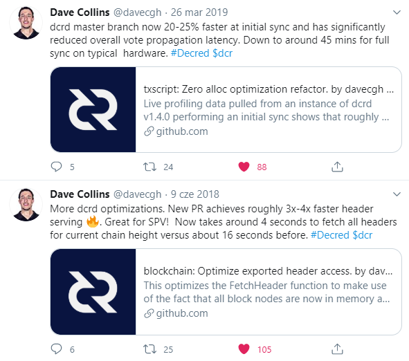

Without further ado, let's take another dive into this strange, but wonderful world. Please follow steps [1](https://github.com/artikozel/decred-articles/blob/master/English/howilearnedtostopworryingandlovethecli/part1-settingupdcrd.md#1-installing-the-os-on-the-microsd-card-and-enabling-ssh-capability) and [2](https://github.com/artikozel/decred-articles/blob/master/English/howilearnedtostopworryingandlovethecli/part1-settingupdcrd.md#2-connecting-to-your-raspberry-pi-via-ssh-and-updating-yoursystem) from the [first installment](https://github.com/artikozel/decred-articles/blob/master/English/howilearnedtostopworryingandlovethecli/part1-settingupdcrd.md) of the Decred Node tutorial to get you up to today's starting point.

### (OPTIONAL) Creating a new user

The topic of ["hardening"](https://www.raspberrypi.org/documentation/configuration/security.md) your Pi has come up before, so now we're going to put at least one such good idea into practice by creating a new user on our system. We're going to do this because we don't want our **pi** user home directory to be the one where we install our software. Even though we're later going to be adding **superuser** privileges to the new account, by creating it we want to ingrain the idea that installing too much stuff under the all-powerful default account is not a good idea if only for the sake of cleanliness.

Log into your Raspberry Pi with your **pi** username and create a new user with the command `sudo adduser dcrnode`.

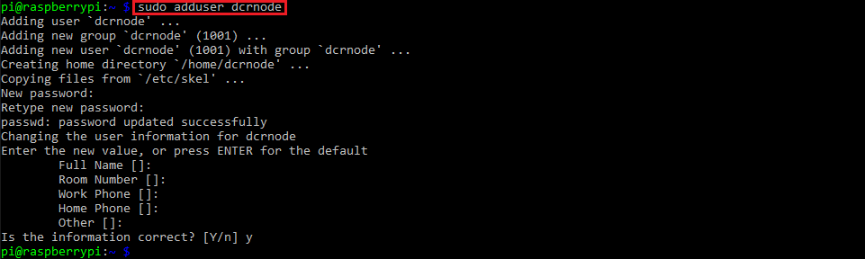

I'm calling mine **dcrnode**, you're free to call it what you want.

In order to perform some of the operations necessary for this tutorial we need to grant this new user **superuser** privileges, so that we can use the **sudo** command. We do this by adding the new user to the **sudo** group, like so:

`sudo usermod -aG sudo dcrnode`

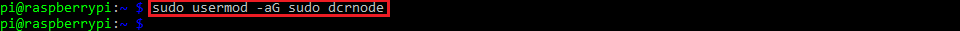

Now, we can log out of this session as **pi** with the command `logout`and SSH back in as the user **dcrnode** using its own password.

After we've done this, we can confirm whether we really have the **superuser** privileges by checking our user groups with the command `groups`

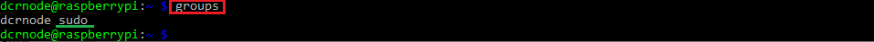

Now, if we want to update our system with the `sudo apt update` command we will see something like this, reminding us of the great responsibility our admin rights come with.


### 1. Installing Go

This project will not go (no apologies for the pun; fight me) anywhere unless we install the Go tools. I based my approach to this topic on [the following tutorial](https://www.e-tinkers.com/2019/06/better-way-to-install-golang-go-on-raspberry-pi/), which I can't recommend enough, as it makes keeping your Go up-to-date incredibly easy - if there's a new version you want to use, delete the old directory and install the new one in its place. It's that clean and simple.

Go to [Go's download website](https://golang.org/dl/) and look for the most recent Go release for your system. At the time of writing, this is **Go 1.14.6**.

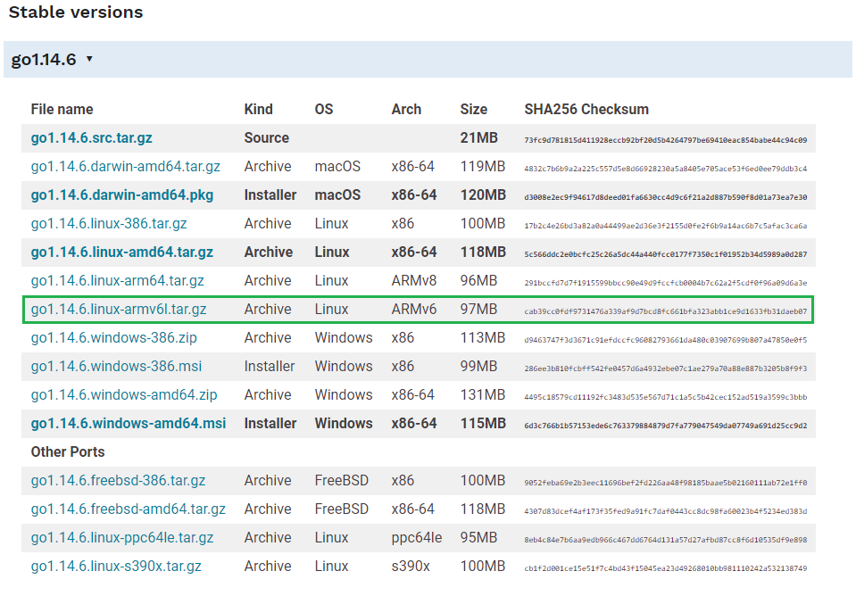

Copy the link and download it with `wget` like so:

`wget https://golang.org/dl/go1.14.6.linux-armv6l.tar.gz`

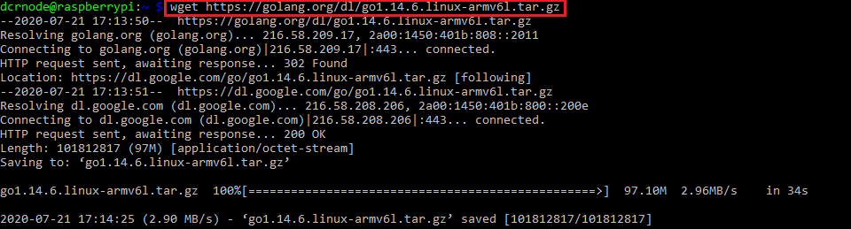

Additionally, we'll verify the SHA256 checksum of the package against the one listed on the download site.

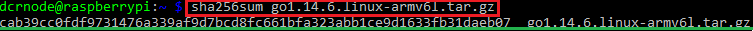

Now, we'll unpack it to the `/usr/local` directory with the command

`sudo tar -C /usr/local/ -xzf go1.14.6.linux-armv6l.tar.gz`

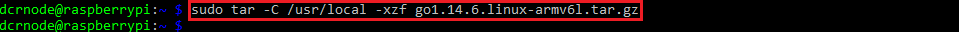

After that, we need to set some **environment variables**.

From your **home directory**, open your **.profile** file with **nano** and add the following lines, as seen below:

```
export PATH=$PATH:/usr/local/go/bin
export GOPATH=$HOME/.go
```

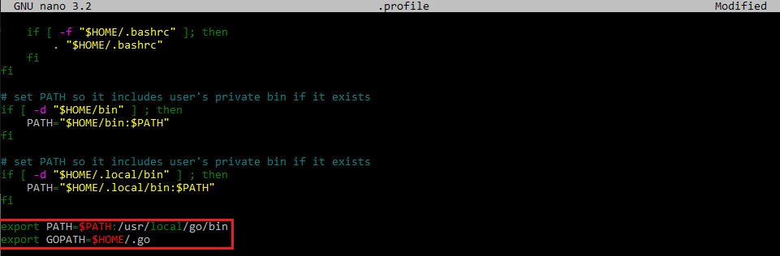

The first line makes sure our system knows where to look for Go tools whenever we issue a Go command, and the second one specifies where Go should look for all Go-related files, like the source code to compile into executable files. Again, I'm setting my `GOPATH` directory to be `~/.go`; you can choose a different name, but you will need to remember it and stay consistent with it throughout the tutorial, substituting your own chosen name/path for mine wherever necessary.

After adding the lines above to the file, save the changes and run the `source .profile` command to make the changes take place immediately.
If successful, then running the `go version` command should give you the following result and confirm that Go is now installed on your Raspberry Pi.

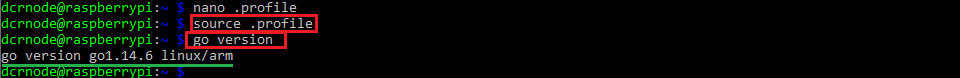

### 2. Installing git

Chances are that a clean Raspberry Pi OS installation does not have Git, which is required to clone code from the Decred repositories, so the next step is to fix that by running the `sudo apt install git` command

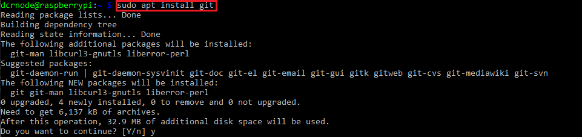

You can also run `git version` to confirm, just like above.

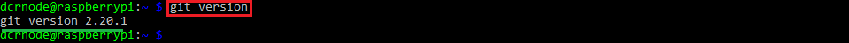

### 3. Setting up the code directory structure and cloning the Decred code repositories

Now is the time to set up the directories where our cloned Go code will live and where its executables will go after installation. This time there is not installer to do it all for us, so we need to get our hands dirty and do it ourselves.
Run the `mkdir -p .go/src/github.com/decred && mkdir -p .go/bin` command to create the directory structure for the code.
Navigate to the `.go/src/github.com/decred` directory, and clone the repositories from the [Decred GitHub page](https://github.com/decred) like so:

```
git clone https://github.com/decred/dcrd
git clone https://github.com/decred/dcrwallet
git clone https://github.com/decred/dcrctl
```

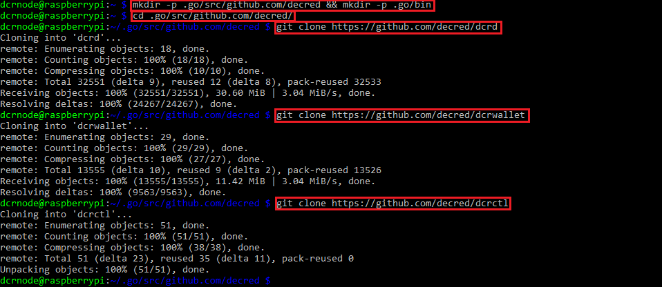

These are the components you need to **run your Decred node, wallet, and enable communication between them**.

After the code has been cloned into respective repositories, navigate to them one-by-one and compile the code contained within into binaries with the `go install` command.

For **dcrd**:

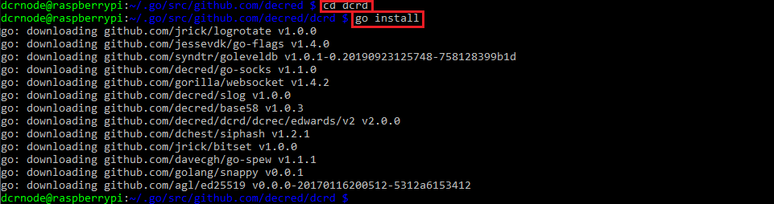

For **dcrwallet**:

Go back up one level in the directory structure with `cd ..` and do the same.

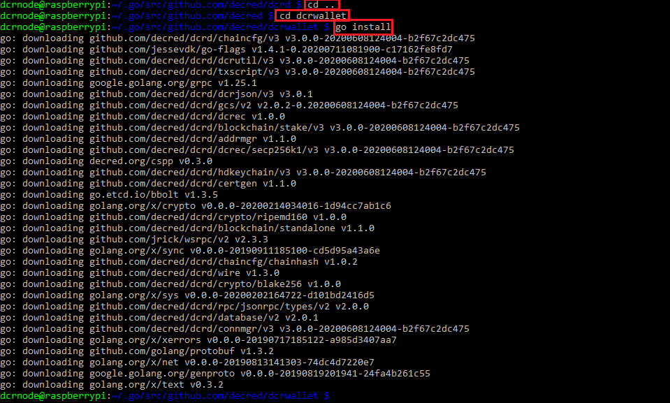

And same for **dcrctl**:

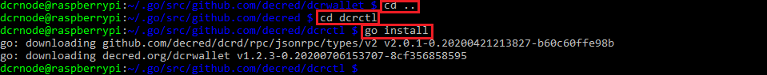

Now, that wasn't hard at all, was it?

If you now go back to your **home directory** and navigate to the `GOPATH` directory we'd discussed earlier, you will see that the `~/.go/bin` directory contains compiled binaries for all 3 pieces of the Decred software we will need today.

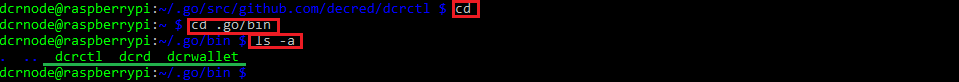

Go back to the **home directory** with `cd` once more, and create the **hidden directories** for them, which will serve as their **appdata directories**, where all the files associated with them, such as the config files, wallet files, blocks, etc., will live.

Run these commands to do so:

```
mkdir .dcrd
mkdir .dcrwallet
mkdir .dcrctl
```

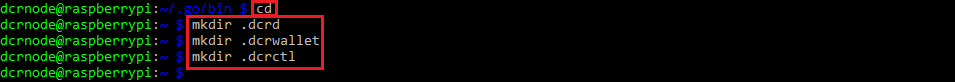

### 4. Setting up the launch script and symlinks creation

Once again, our old friend **tmux** makes an appearance to help us run all the pieces of the Decred software at the same time.

Install **tmux** with `sudo apt install tmux`

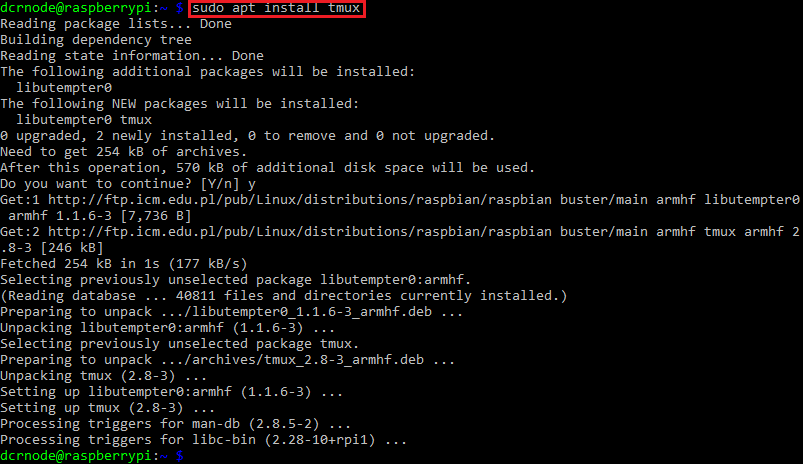

Now we're going to create a short script that will launch our Decred software in separate **tmux** sessions. Unlike in the [previous tutorial](https://github.com/artikozel/decred-articles/blob/master/English/howilearnedtostopworryingandlovethecli/part2-configuringtor.md), this time I'm simply calling this script **decred.sh**, because it'll launch my whole Decred setup for me with one command.

Create and open the script file in your text editor with `nano decred.sh` and write and save the script contents as follows:

`tmux new -d -s dcrd 'dcrd' & tmux new -d -s dcrwallet 'dcrwallet' & tmux attach -t dcrwallet`

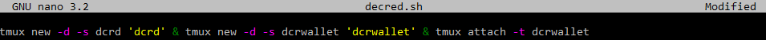

As always, we need to make the script executable with `chmod +x decred.sh`.

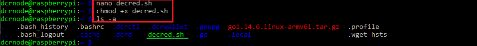

You may notice that there's something different about creating our launch script, apart from its name, of course, and you're right - we're not specifying the full path to the binary files for **dcrd** and **dcrwallet**, because this time we're going to use **symbolic links**, so now that we've got our launch script ready, let's create said links!

Simply speaking, symbolic links act as shortcuts to where the binaries really are, so we don't have to input the full path to the file every time we want to interact with it, and by creating them we are really telling our operating system to go and access the file at the path specified when creating the link. This is very useful, because our intention is to interact with our Decred software through the command-line interface, and if we can minimise the amount of typing we have to do in order to achieve the desired effect, then it's an opportunity we definitely should take.

Mind you, pretty much the same effect can be achieved by using **aliases**, but because I don't want to spoil you for choice and cause paralysis by analysis, we'll stick with **symlinks** for the time being. You are, however, free to explore the alias path for yourself if you're interested.

Let's chain the creation of **symlinks** for **dcrd**, **dcrwallet**, **dcrctl** and our launch script - **decred.sh** as follows:

`sudo ln -s ~/.go/bin/dcrd /usr/local/bin/dcrd && sudo ln -s ~/.go/bin/dcrwallet /usr/local/bin/dcrwallet && sudo ln -s ~/.go/bin/dcrctl /usr/local/bin/dcrctl && sudo ln -s ~/decred.sh /usr/local/bin/decred`

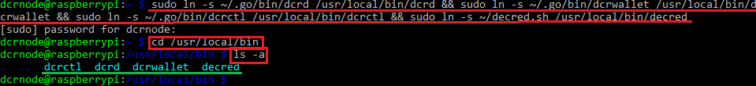

After this is done, we can confirm that the links have been created by going to the `/usr/local/bin` directory and checking it for ourselves with the `ls` or `ls -a` command, as seen above.

Now, let us create our wallet, because that's an essential component of our node setup if we decide to use it for purposes such as solo staking or Politeia voting, for example.

If you want to use an existing wallet seed, use the `dcrwallet --create` command and answer **y** or **yes** when asked about it.

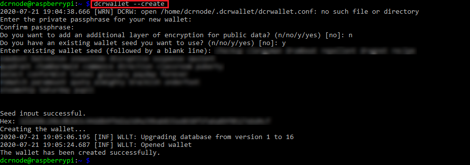

If you don't want to input your existing wallet seed just yet, and simply make sure that your setup works before you decide how to put it to use, create a new wallet with the `dcrwallet --create ` command and generate a new seed by following the on-screen instructions.

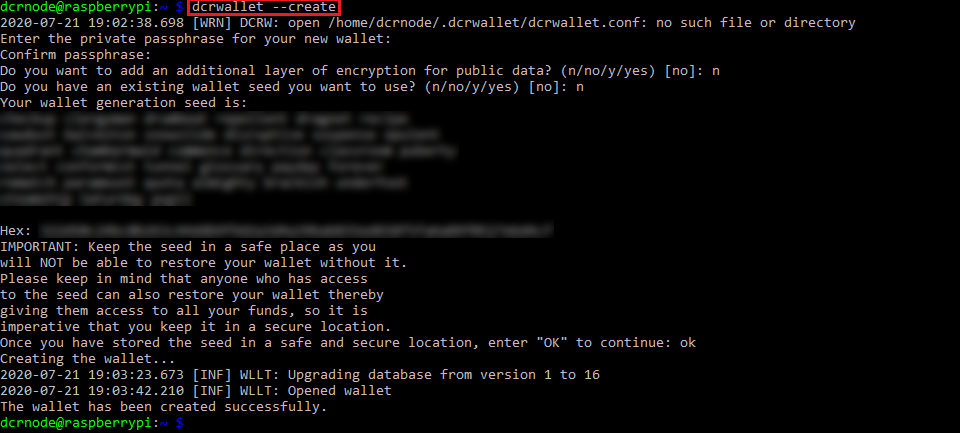

Brief recap: we've just created a script to launch **dcrd** and **dcrwallet** that makes use of symbolic links to make our lives easier, and we have created our wallet, so it's time to go, right?

Let's see if it works!

Launch the script by typing `decred`

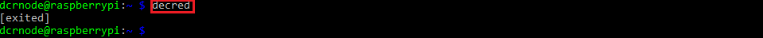

Oops. It looks like nothing has happened, because we're not seeing out wallet activity. Did we make a mistake? Well, no. In fact,


You see, unlike with **dcrinstall**, installing the Decred software from source **does not** automatically create the necessary config files, so we will have to do it ourselves. However, that little manoeuvre with the launch script we've just pulled has actually created our **dcrd.conf** file in the hidden **.dcrd** directory, which is where we start our next step. By the way, by this point your **dcrd** daemon is already happily syncing blocks from the Decred network, which, as you no doubt remember from before, is a process that, at least on our Raspberry Pi, does take some time.

### 5. Initial dcrwallet and dcrctl configuration

We begin our configuration process by copying the sample configuration files for **dcrwallet** and **dcrctl** from their respective source code directories.

Starting with **dcrwallet**, go to its source code directory with `cd .go/src/github.com/decred/dcrwallet` and look up its contents with `ls` or `ls -a`. You will see a file called **sample-dcrwallet.conf**, which contains a comprehensive explanation of all the configuration options for **dcrwallet** that you can edit according to your needs.

Let's copy this file to our hidden **.dcrwallet** directory and save it as **dcrwallet.conf** with the following command:

`cp sample-dcrwallet.conf ~/.dcrwallet/dcrwallet.conf`

Then, we can move to our **.dcrwallet** directory to see if we copied the file successfully.

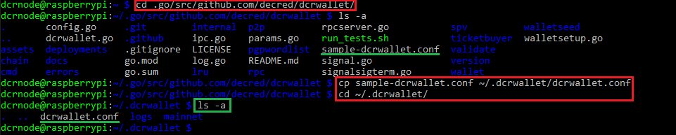

Now, we repeat the same process of copying the sample config file for **dcrctl**.

Go back to the **home directory**, navigate to the **dcrctl** source code directory, copy the file to the **.dcrctl** directory you'd created earlier and double check if the new file is there. See the below screenshot for reference.

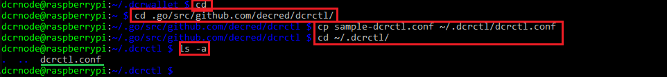

In order to enable **dcrd**, **dcrwallet**, and **dcrctl** to be able to talk to one another, we need to slightly edit their respective config files to make sure they're all using the same credentials.

Navigate to the **.dcrd** directory and open the **dcrd.conf** file in your text editor

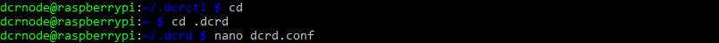

and look for the section of the file that looks like this:

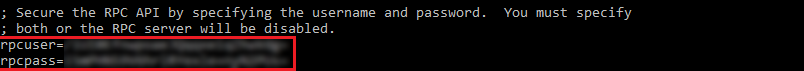

You can either **set these fields to a value of your own choosing** or **keep them** if you're not feeling creative. In any case, configuring our config files for **dcrd**, **dcrwallet**, and **dcrctl** with the same values is how they know they are authorised to communicate with one another.

Let's start with the config file for **dcrctl**. Go back to the **home directory** with `cd`, navigate to the **.dcrctl** directory with `cd .dcrctl`, open the **dcrctl.conf** file in the text editor with `nano dcrctl.conf`, find the relevant section in the file and input the same values for **rpcuser** and **rpcpass** as the ones from the **dcrd.conf** file, making sure you remove the semicolons from the beginning of the lines to uncomment them and make them active. See the below screenshot for reference.

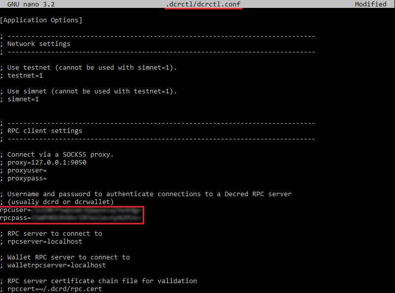

Configuring **dcrwallet** is similar, but slightly different, since the **dcrwallet.conf** file uses the **username** and **password** variables instead of **rpcuser** and **rpcpass**. Repeat the step above for **dcrwallet** by going back to the **home directory**, navigating to **.dcrwallet** with `cd .dcrwallet`, opening the **dcrwallet.conf** file with `nano dcrwallet.conf` and setting the values for **username** and **password** to the same as in the step above.

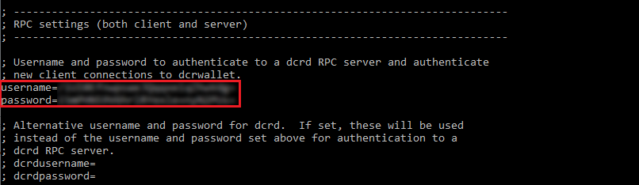

Now that you've done that, all the pieces of our Decred software should be able to talk to one another, so we can run our launch script again to get **dcrwallet** up, which at first launch should look like this:

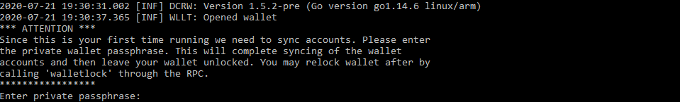

If, for some reason, the script does not automatically attach you to the **dcrwallet** session, you can do this manually with the `tmux at -t dcrwallet` command.

This concludes this part of the tutorial. In the next installment we will go over some basic wallet operations performed in the command line, keeping our node up-to-date, as well as some benefits of using our always-on Decred node on our Raspberry Pi, so stay tuned for more command line goodness!
