# The Decred Node or: How I Learned to Stop Worrying and Love the Command Line

### Part 1 - setting up dcrd on your Raspberry Pi

There comes a moment when once you're deep enough down a rabbit hole an initial simple interest turns into genuine fascination that springs you into more than just passive observation and awakens the desire to learn more and do something useful – you actually want to contribute. However, if, like me, you're not a developer capable of contributing code, or don't think you can help out in one of many other ways the Decred Project welcomes, then a simple act of running a Decred node can reliably scratch that itch of making a small, but measurable contribution to the network.

Why would you want to run a Decred node? Not only is it a great way to learn the very basics of using Linux – a great skill to have and one which can potentially take you down a path to playing around with some more complex systems and applications, such as running your own voting nodes, thus eliminating the need for using a Voting Service Provider or countless others – it also benefits the network in a tangible way by performing a valuable service only at the cost of your hardware purchase and time. Also, the price to pay for running a node is very small as the Decred blockchain is only several GB in size as compared to several hundred in the case of Bitcoin, which means that you will be fine even when running your setup from a micro SD card. Personally, I got hooked in because the satisfaction I got from setting up this kind of digital creation is a very strong dopamine injection, and I hope you will find this to be true for you as well.

### The idea

Even though there are [many(1)](https://stakey.club/en/installing-dcrd/) [excellent(2)](https://medium.com/decred/running-a-decred-raspberry-pi-node-ac605b70c652) [tutorials(3)](https://medium.com/crypto-rocket-blog/my-experience-setting-up-a-decred-full-node-8a9bbf55bc30) on setting up Decred nodes and getting started with Raspberry Pi OS (previously known as Raspbian) a person using an operating system for the first time in their life is sure to run into some basic issues that some tutorials do not cover because they already assume a degree of basic knowledge regarding system administration. Sometimes there are tutorials nested within tutorials, where one step of the process requires an entirely separate tutorial to follow, which can get confusing or completely put you off the task.

In this tutorial I will take you, the reader, through the installation process step-by-step, so that you can gain a bit more confidence using a Linux-based system for fun side projects. I will provide copy-pastable instructions for you to run as well as screenshots for your convenience, alongside explanations of what I'm doing, so you can follow along.

It is also my goal to destigmatize the command-line interface as something regular users shouldn't ever bother with. It was once my belief, too, and to this day I use graphical user interface (GUI) desktops, but if a normie like me can learn how to do it, then so can anyone. Plus, maybe it's a silly thought, but it may even make you feel a bit closer to your machine and the network, too. Therefore, this tutorial will be done mostly in the command line. **Wherever possible I will provide exact commands to run in the code blocks, where each line is a new command.** You are free, but not encouraged, to skip sections marked as **OPTIONAL**.

### The hardware

For our purpose we're going to be using a cheap single-board computer, the popular Raspberry Pi, which can easily run a Decred node. For this tutorial I'm going to be using a [**Raspberry Pi 3 B+**](https://www.raspberrypi.org/products/raspberry-pi-3-model-b-plus/), a **microSD card** (32GB will do just fine), a **micro USB power supply** for the Raspberry Pi, and a **microSD card reader**. It's also good to have an Ethernet cable should anything go wrong with our wireless setup, or if you do not have a WiFi network component wherever you intend to run your node.

### The software

You will need to download and install [**balenaEtcher**](https://www.balena.io/etcher/) and a copy of the [**Raspberry Pi OS**](https://www.raspberrypi.org/downloads/raspberry-pi-os/).

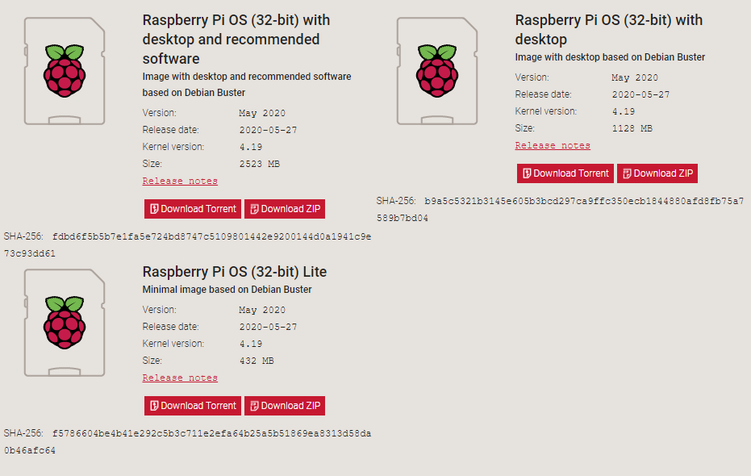

Currently, Raspberry Pi OS is available in the 32bit version, with the 64bit version in beta. Choose whichever version you prefer: with desktop, or without, and download it. Personally I'm going for the *Lite* variant with no desktop environment.

Let's get to it.

### 1. Installing the OS on the microSD card and enabling SSH capability

After you've downloaded your OS image, insert your micro SD card into the reader and plug it into your laptop/desktop PC, open up balenaEtcher and flash the micro SD card with the downloaded OS image.

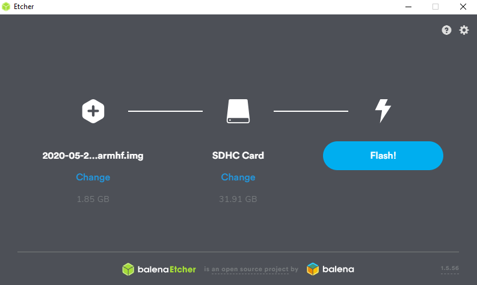


Now, you may need to eject your micro SD card and plug it back in for your computer to recognize it once more (at least I did) so we can proceed to **enabling SSH** straight from boot.

Open the new drive that (re)appears go to it and **create an empty file named ssh with no filetype extension**. You may need to enable filetype extension visibility in your explorer window so you can edit them. It is located under the "view" tab, roughly as depicted, if you're a Windows 10 user.

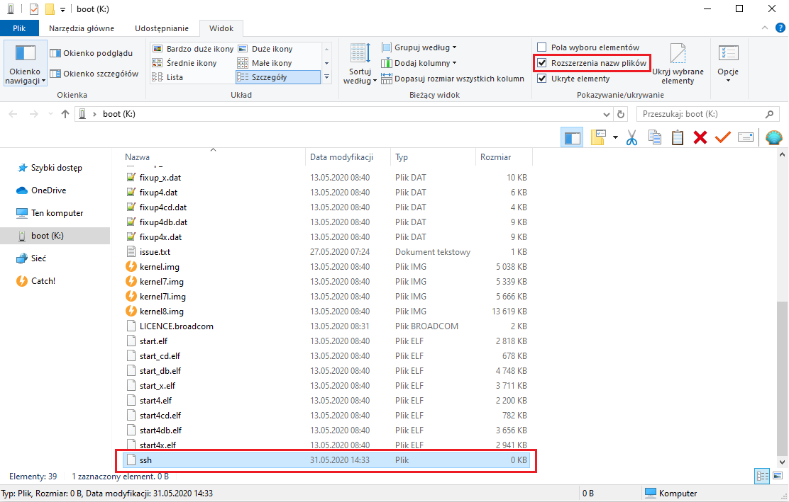

At this point if you eject your micro SD card and plug it into your Raspberry Pi **you are ready to go** if you are using an Ethernet connection for your Pi.

### (OPTIONAL) 1.1- Enabling and setting up your WiFi connection

If you want your Pi to connect to your network and the Internet wirelessly right from the start or you don't have an Ethernet cable at hand we will set up your Pi's WiFi configuration file. To do that you need your wireless network's name (**SSID**) and **password**.

In a similar fashion to the preceding step, **create a file called wpa_supplicant.conf** on the same partition as the extensionless ssh file.

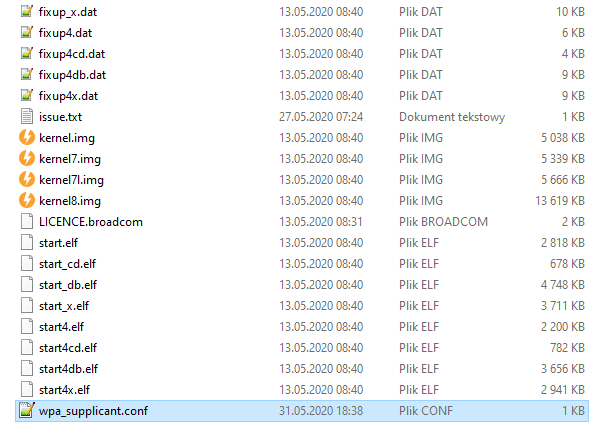

The file should contain the following:

```
country=<YOUR ISO 3166-1 alpha-2 country code>
ctrl_interface=/var/run/wpa_supplicant GROUP=netdev
update_config=1
network={
    ssid="YOUR_SSID"
    psk="YOUR_PASSWORD"
    key_mgmt=WPA-PSK
}
```

This is a **very** delicate procedure, because this file is ridiculously finicky about formatting. Let me explain it visually:

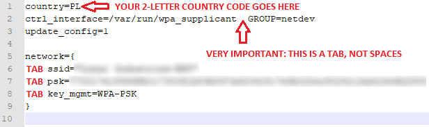

*This is what the wpa_supplicant.conf file looks like for my setup.*

Provide all the necessary information and **remember to put your SSID and password in double quotes**. Save the file, and **make sure you eject the microSD card safely** instead of just pulling it out.

At the end of the day, even if you mess this up, you can still SSH into your Raspberry Pi via Ethernet cable or hook it up to a screen and keyboard and enable your WiFi without the hassle.

### 2. Connecting to your Raspberry Pi via SSH and updating your system

We will be logging in as the default user **pi** and continue with our setup using this account. **This is definitely not a recommended thing to do**, but the goal here is to show you that the command-line interface doesn't bite, and once you get the hang of it you are encouraged to implement [**as many security and "Pi hardening"**](https://www.raspberrypi.org/documentation/configuration/security.md) techniques as you wish, **especially if you intend to keep any DCR on your Raspberry Pi**.

First, open your SSH client of choice (like PuTTY). I will be using the Windows command line. Execute the following command

```
ssh pi@raspberrypi.local
```
, which is one of many names or local addresses you can refer to your Pi by. Then, you will be greeted with a screen that looks like this.

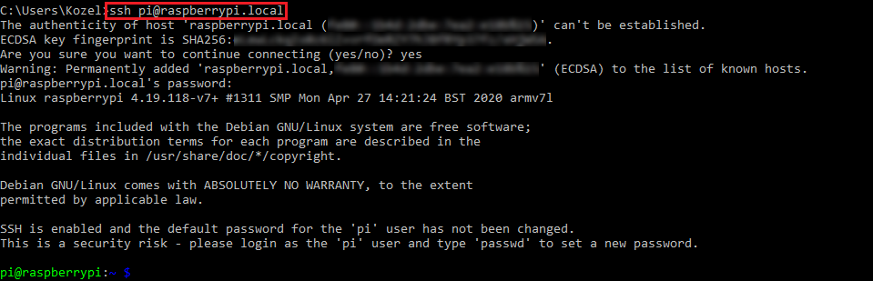

Since this is the first time you're connecting remotely to this machine, your machine doesn't recognise it. Therefore, you must confirm that you want to continue. When you continue, your computer will add the Pi to the list of known hosts and you will not see this notification again.

Time to log in. The default user on a Raspberry Pi is **pi**, and the default password is **raspberry**. After you log in the system will tell you about the necessity of changing your default user password, **which you should absolutely do** by doing

```
passwd
```

and following on-screen instructions.

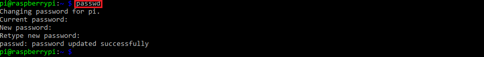

### (OPTIONAL) A quick note about basic operations and use of Linux.

Since we are now logged into our machine and we're using a non-graphical user interface, for many new users this will be a very alien experience, but remember one thing – **don't panic**.


This little guy, the **"$"** sign a.k.a **the prompt**, is your friend. The whole setup tells you which user you are logged in as (in this case the user **pi**), the hostname you're logged into (**raspberrypi**), and where you currently are (**~**, one of the ways of referring to the user's **home directory**). 

One thing which tripped me up at the very beginning is what a successful operation often looks like in Linux; most of the time there is no confirmation that we did something successfully, such as moving to a given directory without issues, which is something we normally understand while using a GUI. After all, there's not pat on the shoulder for a job well done when clicking a file in a GUI environment, but at least for me the lack of something like a reassuring message was something I needed to get over in a text-based environment. Now it just makes sense, and **as long as you're not making mistakes your system will not yell at you**.

In the tutorial we will be moving around our system, visiting different directories, with the use of the **cd** command to **c**hange **d**irectory. For example, let me move somewhere from our home directory with

```
cd /usr/bin
```

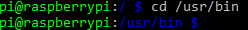


You see? My prompt always keeps track of where I currently am. Let's have a look around with the **ls** command, which **lists the contents of the directory that we are currently in**.

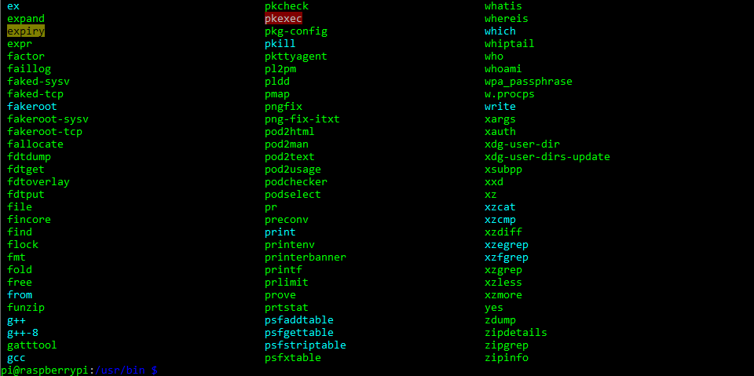

Whoa, that's a lot of files, and that's not even the whole list! Remember, **don't panic**. 

In this tutorial we will be using our home directory to navigate from. It is also where we will create a lot of directories for our files and software. The easiest way to return to our home directory – for example, if you get a bit lost – is to just use the **cd** command without specifying where you want to go, and it will always take you home.

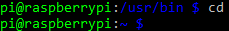

Another command we will be using from time to time is the **sudo** command, which allows us to execute other commands with **superuser privileges**, which are kind of like administrator rights, often in situations that require us to change or access existing system files.

There are tons of existing resources on the basics of Linux, so many, in fact, that I won't even bother linking to any of them. By merely searching for "Linux basics" it is hard not to trip over valuable and useful information on this topic. It is highly recommended that you take some extra time to research this topic, as being a Raspberry Pi owner now you are in excellent position to learn some basics of Linux use.

Without further ado, it's time to update our system so we're not missing out on any developments. Run

```
sudo apt update
sudo apt upgrade -y
```

, which downloads information about the most recent system package updates and upgrades them.

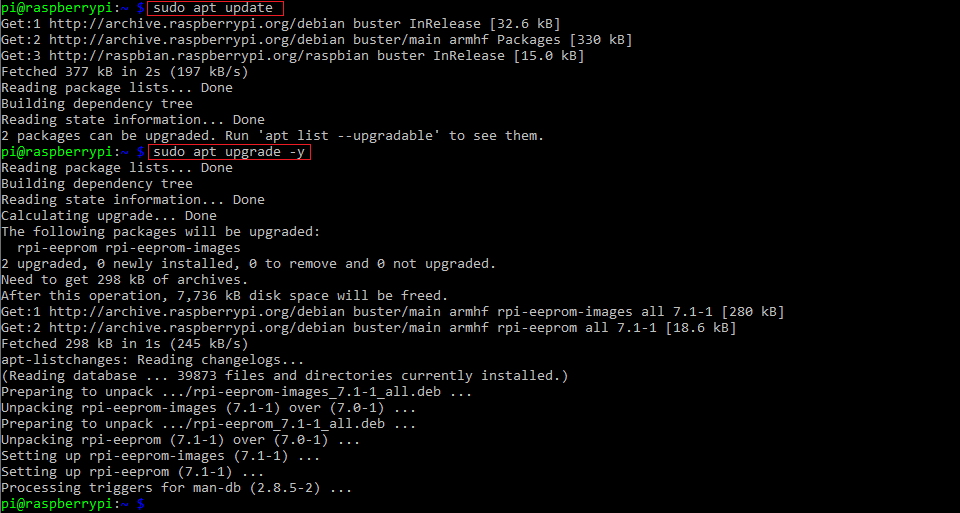

The **sudo** command will sometimes (unless configured otherwise) ask you for your **user password** as a safety measure; **this is perfectly normal**.

### 3. Downloading our Decred software

Because we're SSHing into our Pi, we are free to look things up on our browser, so let's find the most recent version of the Decred software. Go to [**decred.org/wallets/**](https://decred.org/wallets/) and look for **command line-app suite** under **core software** and click **view on GitHub**.

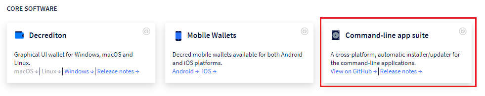

For now, with our 32bit operating system we will need the version of **dcrinstall** marked with the **red arrow**.

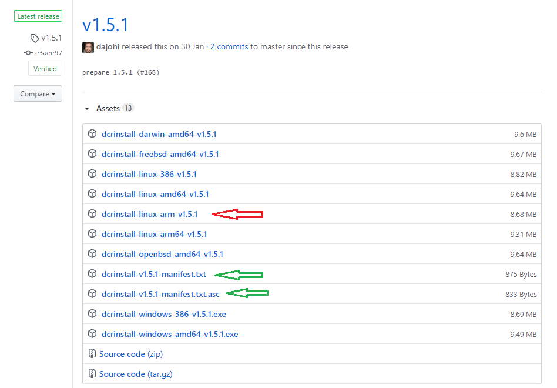

Grab the link to the highlighted version of **dcrinstall** by right-clicking it and copying the link and pasting it together with the **wget** command to look like this

```
wget https://github.com/decred/decred-release/releases/download/v1.5.1/dcrinstall-linux-arm-v1.5.1
```

and confirm by hitting enter.

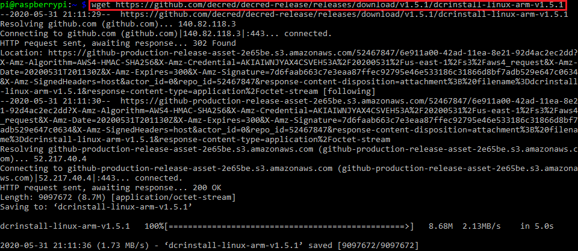

### (OPTIONAL) 3.1- Verifying Decred binaries

If you want to **verify your binaries** please download the files marked with the **green arrow** ([**dcrinstall-v1.5.1-manifest.txt**](https://github.com/decred/decred-release/releases/download/v1.5.1/dcrinstall-v1.5.1-manifest.txt) and [**dcrinstall-v1.5.1-manifest.txt.asc**](https://github.com/decred/decred-release/releases/download/v1.5.1/dcrinstall-v1.5.1-manifest.txt.asc)) from one of the previous screen shots.

```
wget https://github.com/decred/decred-release/releases/download/v1.5.1/dcrinstall-v1.5.1-manifest.txt
wget https://github.com/decred/decred-release/releases/download/v1.5.1/dcrinstall-v1.5.1-manifest.txt.asc
```

Run **ls -a**, and your home directory should look something like this by this point.

```
ls -a
```

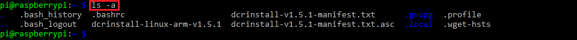

The **-a** argument while running **ls** lists all the files and directories in the given directory, **including the hidden ones**, which we will be seeing in the course of our journey.

In order to verify our software binary file, we will need to get hold of the **Decred releases public key**, which is provided in the [**"verifying binaries"**](https://docs.decred.org/advanced/verifying-binaries/) section of the Decred documentation, which we will now go to in order to find this key block

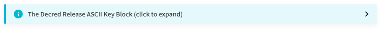


expand it, **copy the whole thing to your clipboard**, from `-----BEGIN PGP PUBLIC KEY BLOCK-----` all the way to ``-----END PGP PUBLIC KEY BLOCK-----``, **remembering to include both of them** and then create a file **key.txt** by doing this:

```
nano key.txt
```

This will take you to an empty file opened in the nano text editor, to which you will now copy the Decred public key, save it by hitting the combination of **ctrl+x** keys (**^X** in this notation means **ctrl+x**), confirming changes to the file with **"y"** at the bottom of your screen and hitting the **enter** key (we don't want to change the name of the file, which the last prompt allows you to do).

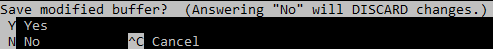

After we've done that, it's time to import the Decred release key into our keyring, so we can use it to check the validity of documents signed with it.
We can import the key with the following command

```
gpg --import < key.txt
```

and get confirmation that the key was successfully imported by running the `gpg --list-keys` command as seen below.

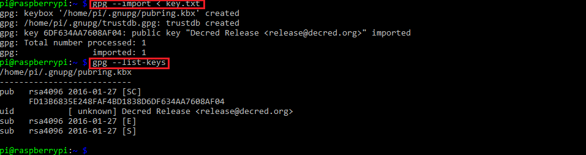

In order to verify whether we can trust the data in the dcrinstall-v1.5.1-manifest.txt file, run the following command:

```
gpg --verify dcrinstall-v1.5.1-manifest.txt.asc
```

GPG will assume the signature pertains to the **dcrinstall-v1.5.1-manifest.txt** file, and as soon as you see "Good signature from 'Decred Release <release@decred.org>'" you know the manifest file and its contents can be trusted. Alternatively, you can run `gpg --verify dcrinstall-v1.5.1-manifest.txt.asc dcrinstall-v1.5.1-manifest.txt`, which verifies the signature directly against the manifest file, at which point gpg makes no assumptions at all.

Having done that, it's time to see if our binary file checksum matches the one from the manifest, which conclusively proves that the binary came from the Decred team and not a malicious third party. We will do that by running `sha256sum dcrinstall-linux-arm-v1.5.1` and running `cat dcrinstall-v1.5.1-manifest.txt` immediately after to see if the checksums from our version of the installer and the manifest match, as seen below.

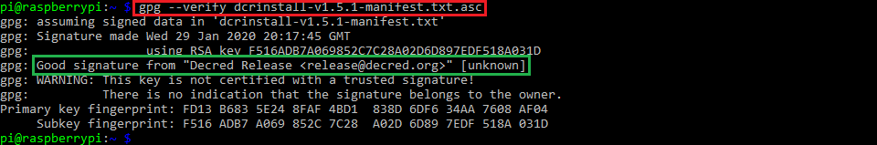

### 4. Installing the Decred software from the binary file

Now that we've got the binary file on our Raspberry Pi, we need to make it executable in order to run it. This is done with the command `chmod +x dcrinstall-linux-arm-v1.5.1`, which, if done successfully, should make the binary file turn green, like some of the files we saw earlier in section no. 2, like so:

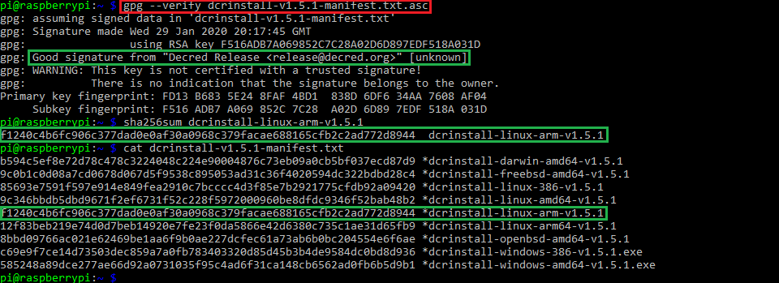

You can check it for yourself by running the **ls -a** command.


**Green means go**, therefore, without further ado, let's install our Decred software with `./dcrinstall-linux-arm-v1.5.1.`

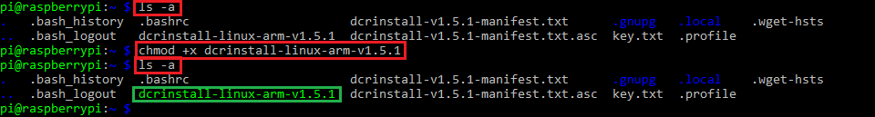

`./` placed before the name of the executable file or a script is a way to execute it without providing the absolute path to the file – it's enough that you're in the same directory. The same effect could have been achieved by providing the full, absolute path, i.e. `/home/pi/dcrinstall-linux-arm-v1.5.1.`

After the whole litany of things being done by the installer, if this is your first time installing the Decred software on your machine, you will be asked to provide a private passphrase for your wallet, which **dcrinstall** will also create for you. Since we're just interested in **dcrd**, for now we don't need to worry about this step and we can provide any passphrase we'd like. Likewise, we don't need to worry about saving the seed for the wallet, because we're not going to be using one at this point, and should we decide to do so, we can always generate another one – but that's beyond the scope of this particular tutorial. Therefore, let's just follow the on-screen instructions until this step has been completed.

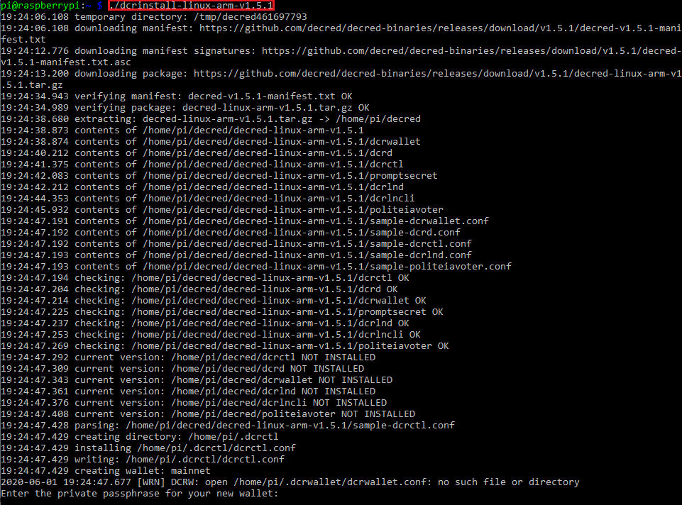

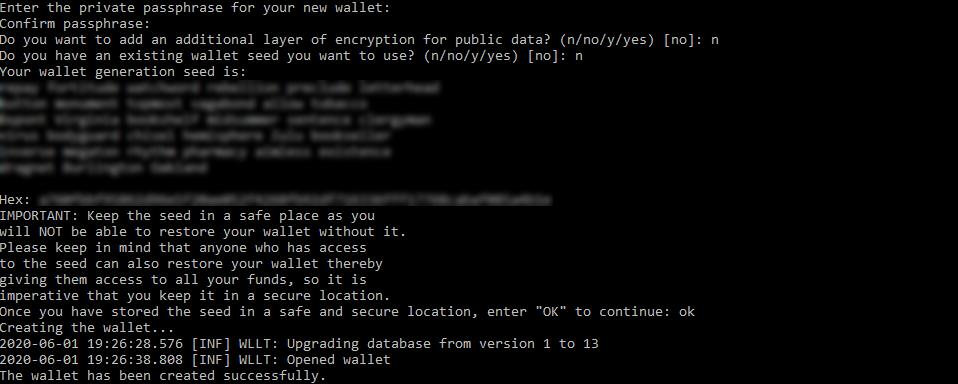

You will see, with the use of the **ls -a** command, that the Decred installer has created some **hidden directories** (those with the **'.'** in front) that weren't there before in our home directory, which is where the config files, amongst others, like logs and database files, for the separate pieces of our Decred software will go once they're created. There's also the **decred** directory, which contains executable files for the abovementioned pieces of the Decred machinery.

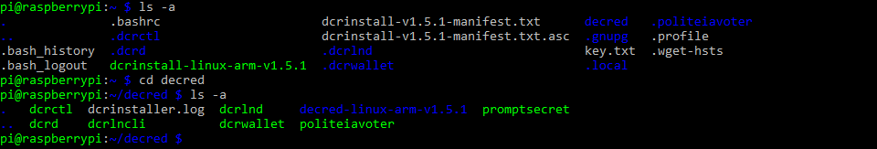

Is this it? Can we finally start our Decred node? Not so fast! It's probably been a lot to take in, especially if you've never done anything like it before. Therefore, before we proceed let's take a short break to appreciate how far we've already come. Apart from that, there's one more thing that I would like to suggest that you do, which can greatly benefit the Decred project: setting up and configuring TOR to run with and alongside our node, which is going to be the focus of part 2 of this series.


Thank you for sticking with me, and hopefully see you in part 2!
