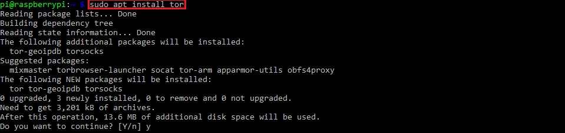
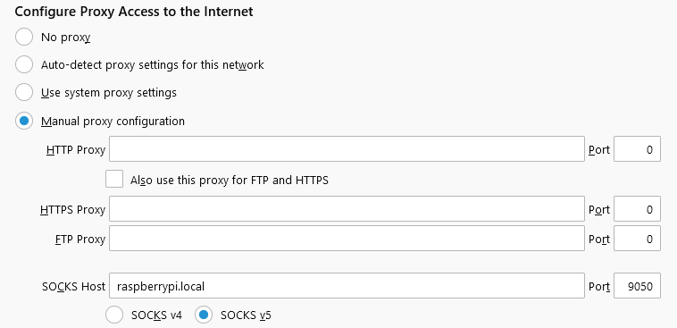
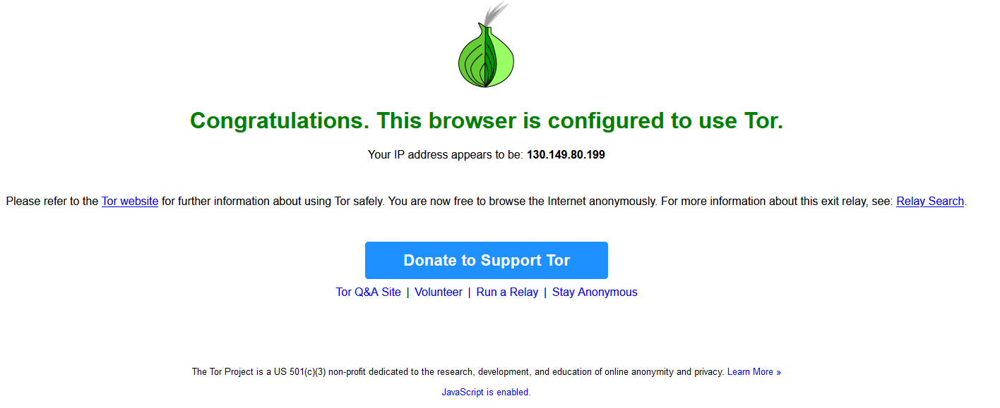
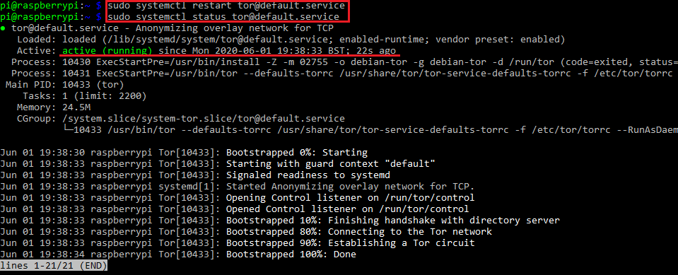
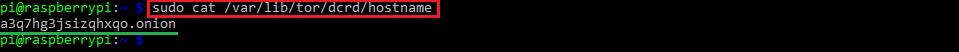
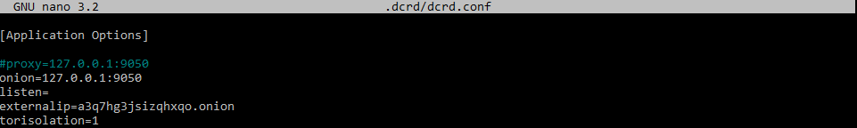
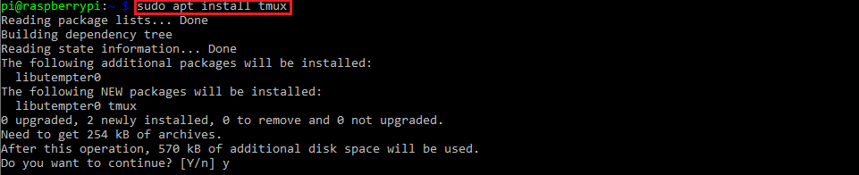
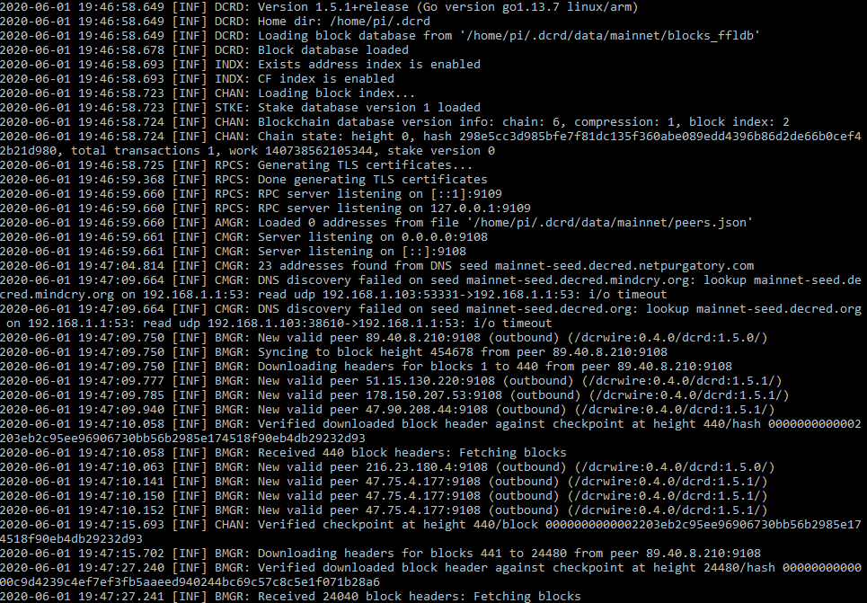

# The Decred Node or: How I Learned to Stop Worrying and Love the Command Line

### Part 2 - setting up TOR on your Raspberry Pi

Congratulations! It looks like you've survived the first part of the tutorial and you're hungry for more. Good! In this part we will set up TOR on our Raspberry Pi.
Again, as with many things Decred, there are excellent guides on how to do it, like this one by our Decred developers and this one by Marcelo Martins, which are perfectly fine and were instrumental in helping me configure TOR on my Pi. However,  if you're reading this part of me hopes that you didn't completely hate the detailed and hopefully beginner-friendly approach from the first part.


While installing and using TOR with **dcrd** is easier than you might think, our devs ask us to consider taking the time to set up a TOR hidden service for our node so that we can help out the Decred network even more, and since maximising the benefit to the Decred network is my priority for this tutorial, this is exactly what we will do.

Let's begin with downloading and installing TOR. Run the following command and follow the on-screen instructions:

`sudo apt install tor`



After we're done we'll edit the TOR config file. Since this is not our home directory, where we can change things as we please, in order to write to the file we need to prefix our commando with **sudo**.


Run `sudo nano /etc/tor/torrc` to open the file with superuser privileges and edit the top of the file to look something like this:


Let's explain what we see here:

`SocksPort 9050` - directs network traffic to TOR through this default port for all services on this machine configured to use it. On by default, but it doesn't hurt to put it here also.

`SocksPort raspberrypi.local:9050`- because we are using this very handy method of accessing our Raspberry Pi on the local network we can do a **cool trick**. Basically, you can use this address and port as a proxy for your Internet browser so that it will route its traffic through TOR without having to use a Tor Browser (which is **still recommended** if you're into this sort of thing because it does a **lot** more than just route your traffic). To do this, you need to find your browser's network setting, which for Firefox looks like this: Options -> Network settings -> Manual proxy configuration



which ultimately gets you this result:




`RunAsDaemon 1` - starts the TOR process in the background.

`HiddenServiceDir /var/lib/tor/dcrd` - our hidden service directory; we need to specify a directory for our hidden service where TOR will store its **.onion** address and private key. Since the TOR data directory is in `/var/lib/tor`, just adding the name of the directory where we want these files is enough. In my case I used the name `dcrd`.

`HiddenServiceVersion 2`- **VERY IMPORTANT**. dcrd **does not support v3�.onion addresses**, so we need to specify that we want a v2 .onion address for our hidden service (16 characters long).

`HiddenServicePort 9108 127.0.0.1:9108`- redirects requests on port 9108 to our Raspberry Pi's localhost address and port 9108, where our **dcrd** instance is listening for incoming connections.

Now that we're on the same page, let's save the changes (yes, with `ctrl+x` followed by a `y` and the **enter** key).

After saving the changes in the TOR config file let's **restart the TOR service** with `sudo systemctl restart tor@default.service` so that TOR may generate our **.onion** address and **check its status** with `sudo systemctl status tor@default.service`, which should look something like this:



Indeed, our TOR service is running. You can exit this view by hitting `ctrl+c` to bring you back to the prompt.

Now that the TOR service has been restarted, let's check out the **.onion** address it has generated for us.

Run `sudo cat /var/lib/tor/dcrd/hostname`, which will give you the contents of the `hostname` file. It should look all messed up, like a typical **.onion** address, underlined **in green**.



**Copy and save this address**, because we will need it in a second.

**Dcrinstall** has made some hidden directories (starting with "**.**" - which you can see by including the **-a** argument with the **ls** command) for Decred daemons in our home directory. This is where Decred software stores its files and config files.

We will now read and alter the contents of the **dcrd.conf** file which resides in the hidden **.dcrd** directory by running the following command

`nano .dcrd/dcrd.conf`

and, once again, editing the top of the file to look something like this:



#### Now a word or two about the `proxy` and `onion` lines.

At the beginning of this part I mentioned that maximising the benefit to the Decred network will be my priority. With TOR there are two paths you can follow:

- the `proxy` route will make your node behave like as a TOR client. It will check for new blocks, transactions and synchronise over the TOR network. If you want your node to be **anonymous** then **this is the option you should choose**, and your **dcrd.conf** file should look like this:

```[Application Options]

proxy=127.0.0.1:9050
listen=
externalip=a3q7hg3jsizqhxqo.onion
torisolation=1
```

- the `onion` route, however, makes your node act as a bridge between the TOR network and traffic over regular Internet, as is an example of a client-server setup. As a result, your own node's traffic **will not** be anonymous, but the benefit of that is that **both** the clearnet and the TOR nodes can connect to your node as peers. I feel that out of the two options this affects the network in the most positive way, so this is the route I will go, and my **dcrd.conf** file will look like this:

```[Application Options]

onion=127.0.0.1:9050
listen=
externalip=a3q7hg3jsizqhxqo.onion
torisolation=1
```

The **dcrd.conf** file has this to say about the `listen` argument:

> Specifying a proxy will disable listening for incoming connections unless listen addresses are provided via the 'listen' option.

Therefore, if you pick the `proxy` path, you need it for **dcrd** to listen for incoming connections. Personally, even though it is not required, I left the `listen` argument in even for the `onion` path, as I found that it helps with node visibility if your setup requires port forwarding.

In both options connections over TOR should be coming thanks to specifying the `externalip` argument and setting it to the **.onion** address you acquired a moment ago.

The `torisolation` argument, to quote our docs once more:

> (...) forces Tor to build a new circuit for each connection making it harder to correlate connections.

Whichever path you choose, save your config file and let's move on.

Because we are using SSH to connect to our Raspberry Pi, any application started in our terminal will be terminated when we log out. Therefore, we need an easy way to keep processes running even after we disconnect fro our machine, which is where **tmux** comes in.

Let's install **tmux** with `sudo apt install tmux`



After this is done, for the sake of convenience we will create a script that will create a **tmux** session with **dcrd** running inside it and attach to it.

Run the following command:

`echo "tmux new -d -s dcrd './decred/dcrd' & tmux attach -t dcrd" > launch.sh`

It will create a script named **launch.sh** with instructions for **tmux** to create a new session under the name "dcrd" and execute the **dcrd** binary which is located in the `decred` directory and then attach to the session.

Of course, let's make the script executable by doing `chmod +x launch.sh`

Lastly, let's spin up our **dcrd** node with `./launch.sh`

Sometimes the attaching step doesn't work and you might get a false-negative "no sessions" message, but you can attach to the session yourself by running `tmux attach -t dcrd`. To detach from **tmux** sessions use the combination of keys `ctrl+b` followed by just `d`.

Finally, after toling in the command line for what surely must have felt like forever, we are rewarded with this glorious sight



, which serves as proof that we have **successfully set up a dcrd node**.

Now it's time to give yourself a well-deserved rest and give your node ample time to download the blockchain, which using the simplest Raspberry Pi setup with a microSD card will probably take half a day, so don't feel obliged to stare at the screen while it does its thing.

Final confirmation of things working as intended is when you start seeing inbound connections like these:


With a **dcrd** node set up in this fashion you can close your SSH session without worrying that your node will shut down. On a related note, I think it goes without saying that your Raspberry Pi needs to remain connected to power in order to keep  working, but in the event you do need to switch it off, please do the following:

- log into your Pi
- attach to your **dcrd** session
- shut your **dcrd** session down cleanly with the keyboard shortcut `ctrl+c`
- shut down your Raspberry Pi with `sudo shutdown 0` before disconnecting it from powered

Always make sure to **cleanly** shut down your **dcrd**, because just powering off your Pi may **corrupt** the blockchain, requiring you to delete it and download it once more.


#### Acknowledgements

Huge thanks to the man with the patience of an angel - @degeri - for pointing out the issue with v3 .onion addresses and dcrd and for enduring stupid questions. You've saved a man from spinning in circles for several more hours.

Thanks to @jz for writing the now-classic guide for setting up solo staking and hot voting wallets, which I believe has been incorporated and now forms the backbone of the [solo proof-of-stake voting](https://docs.decred.org/advanced/solo-proof-of-stake-voting/) section of our docs.

Thanks to @karamble for showing me that the Decred experience does not end at GUI wallets.

Thanks to @Exitus for very helpful feedback on the draft.
