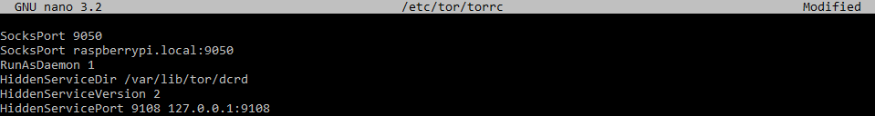
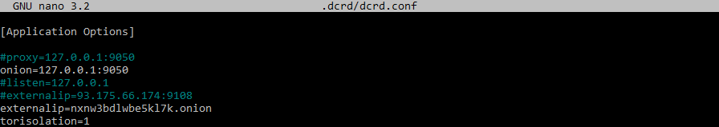

# The Decred Node or: How I Learned to Stop Worrying and Love the Command Line - Part Two


### Part 2 - setting up TOR on your Raspberry Pi

Congratulations! It looks like you've survived the first part of the tutorial and you're hungry for more. Good! In this part we will set up TOR on our Raspberry Pi.
Again, as with many things Decred, there are excellent guides on how to do it, like [**this one**](https://github.com/decred/dcrd/blob/master/docs/configuring_tor.md) by our Decred developers and [**this one**](https://stakey.club/en/decred-via-tor-network/) by Marcelo Martins, which are perfectly fine and were instrumental in helping me configure TOR on my Pi. However, if you're reading this, part of me hopes that you didn't completely hate the detailed and hopefully beginner-friendly approach from the first part.

While installing and using TOR with **dcrd** is easier than you might think, our devs ask us to consider taking the time to set up a TOR hidden service for our node so that we can help out the Decred network even more. Since maximising the benefit to the Decred network is my priority for this tutorial, this is exactly what we will do.
Apart from benefitting the network, learning how to install, configure, and use TOR with your Decred software has measurable benefits to **you**, the user.

You see, the Decred developers saw it fit to make other pieces of the Decred puzzle compatible with TOR. One such example is **politeiavoter**, which lets you trickle in your Politeia votes through the TOR network over a specified period of time within the proposal voting period. This not only enhances your privacy as a stakeholder (should you feel comfortable enough to use your Raspberry Pi node as your Decred wallet in the future) by disassociating your individual votes from your IP address, but also feels like a sign of respect towards the devs who made it possible in the first place.  

To me, having such tools at one's disposal but never bothering to learn how to use them sounds like a huge waste, because I feel that if devs from all around the world take the time to build cool stuff, we can at least appreciate the effort by using it. This is exactly why we're taking this extra step in our Decred journey - to lay the foundations for our potential future uses of this technology.

Let's begin with downloading and installing TOR. Run the following command and follow the on-screen instructions:

`sudo apt install tor`


After we're done we'll edit the TOR config file. Since this is not our home directory, where we can change things as we please, in order to write to the file we need to prefix our command with **sudo**.

Run `sudo nano /etc/tor/torrc` to open the file with superuser privileges and edit the top of the file to look something like this:



Let's explain what we see here:

`SocksPort 9050` – directs network traffic to TOR through this default port for all services on this machine configured to use it. On by default, but it doesn't hurt to put it here also.

`SocksPort raspberrypi.local:9050`– because we are using this very handy method of accessing our Raspberry Pi on the local network, we can do a **cool trick**. Basically, you can use this address and port as a proxy for your Internet browser so that it will route its traffic through TOR without having to use a Tor Browser (which is **still recommended** if you're into this sort of thing because it does a **lot** more than just route your traffic. **DO NOT do anything you wouldn't normally do, even when running your browser through a proxy**). To do this, you need to find your browser's network settings, which for Firefox looks like this: Options -> Network settings -> Manual proxy configuration


which ultimately gets you this result:


`RunAsDaemon 1` – starts the TOR process in the background.

`HiddenServiceDir /var/lib/tor/dcrd` – our hidden service directory; we need to specify a directory for our hidden service where TOR will store its **.onion** address and private key. Since the TOR data directory is in `/var/lib/tor`, just adding the name of the directory where we want these files is enough. In my case I used the name `dcrd`.

`HiddenServiceVersion 2`- **VERY IMPORTANT**. dcrd **does not support v3 .onion addresses**, so we need to specify that we want a v2 .onion address for our hidden service (16 characters long).

`HiddenServicePort 9108 127.0.0.1:9108`- redirects requests on port 9108 to our Raspberry Pi's localhost address and port 9108, where our **dcrd** instance is listening for incoming connections.

Now that we're on the same page, let's save the changes (yes, with `ctrl+x` followed by a `y` and the **enter** key).

After saving the changes in the TOR config file let's **restart the TOR service** with `sudo systemctl restart tor@default.service` so that TOR may generate our **.onion** address and **check its status** with `sudo systemctl status tor@default.service`, which should look something like this:


Indeed, our TOR service is running. You can exit this view by hitting `ctrl+c` to bring you back to the prompt.

Now that the TOR service has been restarted, let's check out the **.onion** address it has generated for us.

Run `sudo cat /var/lib/tor/dcrd/hostname`, which will give you the contents of the `hostname` file. It should look all messed up, like a typical **.onion** address, underlined **in green**.


**Copy and save this address**, because we will need it in a second.

**Dcrinstall** has made some hidden directories (starting with "**.**" - which you can see by including the **-a** argument with the **ls** command) for Decred daemons in our home directory. This is where Decred software stores its files and config files.

We will now read and alter the contents of the **dcrd.conf** file which resides in the hidden **.dcrd** directory by running the following command

`nano .dcrd/dcrd.conf`

and, once again, editing the top of the file to look something like this:



For now ignore the lines with a hashtag in front of them, as they are temporarily disabled.

#### Now a word or two about the `proxy` and `onion` lines.

At the beginning of this part I mentioned that maximising the benefit to the Decred network will be my priority. With TOR there are two paths you can follow:

- the `proxy` flag by itself would make your node behave like as a TOR client, **but** since we took the time to set up a hidden service we will also be able to accept connections from others connecting to the Decred network through TOR. In short, our node will check for new blocks, transactions and synchronise over the TOR network and act as a peer for other anonymous TOR **dcrd** nodes. If you want your node to be **anonymous** then **this is the option you should choose**, and your **dcrd.conf** file should look like this:

```[Application Options]

proxy=127.0.0.1:9050
listen=127.0.0.1
externalip=nxnw3bdlwbe5kl7k.onion
torisolation=1
```

- the `onion` route, like the one above, is also an example of a client-server setup, which makes your node act as a bridge between the TOR network and traffic over regular Internet.  As a result, your own node's traffic **will not** be anonymous, but the benefit of that is that **both** the clearnet and the TOR nodes can connect to your node as peers, and your node accepts the TOR connections via TOR, and regular ones via clearnet. Even at the cost of this node's anonymity, I feel that out of the two options this one affects the network in the most positive way, so this is the route I will go, and my **dcrd.conf** file will look like this:

```[Application Options]

onion=127.0.0.1:9050
externalip=nxnw3bdlwbe5kl7k.onion
torisolation=1
```

The **dcrd.conf** file has this to say about the `listen` argument:

> Specifying a proxy will disable listening for incoming connections unless listen addresses are provided via the 'listen' option.

Therefore, if you pick the `proxy` path, you need it for **dcrd** to listen for incoming connections, because the proxy path disables this function by default. You need to specify the localhost address of your Pi, `127.0.0.1`, so that it only listens for connections originating from and sent to that address.

In both options connections over TOR should be coming to our node thanks to specifying the `externalip` argument and setting it to the **.onion** address you acquired a moment ago.

The `torisolation` argument, to quote our docs once more:

> (...) forces Tor to build a new circuit for each connection making it harder to correlate connections.

Whichever path you choose, save your config file and let's move on.

Because we are using SSH to connect to our Raspberry Pi, any application started in our terminal will be terminated when we log out. Therefore, we need an easy way to keep processes running even after we disconnect from our machine, which is where **tmux** comes in.

Let's install **tmux** with `sudo apt install tmux`


After this is done, for the sake of convenience we will create a script that will create a **tmux** session with **dcrd** running inside it and attach to it.

Run the following command:

`echo "tmux new -d -s dcrd './decred/dcrd' & tmux attach -t dcrd" > launch.sh`

It will create a script named **launch.sh** with instructions for **tmux** to create a new session under the name "dcrd" and execute the **dcrd** binary which is located in the `decred` directory and then attach to the session.

Of course, let's make the script executable by doing `chmod +x launch.sh`

Lastly, let's spin up our **dcrd** node with `./launch.sh`

Sometimes the attaching step doesn't work and you might get a false-negative "no sessions" message, but you can attach to the session yourself by running `tmux attach -t dcrd`. To detach from **tmux** sessions use the combination of keys `ctrl+b` followed by just `d`.

Finally, after toiling in the command line for what surely must have felt like forever, we are rewarded with this glorious sight


, which serves as proof that we have **successfully set up a dcrd node**.

Now it's time to give yourself a well-deserved rest and give your node ample time to download the blockchain, which using the simplest Raspberry Pi setup with a microSD card will probably take half a day, so don't feel obliged to stare at the screen while it does its thing.

#### Now a word or two about port forwarding.

Since we're using a Raspberry Pi connected to our own home network for this project, there is a very high chance your home network is behind a NAT router. Most such routers are configured not to allow incoming traffic by default in order to protect your home network from outside threats. Unfortunately for us, inbound connections to our Decred node are treated as unsolicited, and therefore perceived as a threat, which almost renders our little experiment in growing the Decred network futile. Thankfully, there is a way around it.

Part 1 of the tutorial mentions **port forwarding**, which is a technique that allows us to redirect the incoming traffic to a specific port on a given machine in our network. Setting up port forwarding is how we open up the port that **dcrd** listens on for connections to the rest of the world.

Please note that **every router is different**, so you may need to consult the instruction manual for your particular make and model of router in order to configure port forwarding properly. The general idea, however, is mostly the same, and I'll show you what it looks like using my home router, a **TP-Link Archer MR200**.

First, access your router. This is usually done by typing an IP address specific to your make and model of router into your browser. You will probably arrive at a login page where you need to provide a password. These passwords are often included on stickers along with the rest of pieces of information required to change your router's settings, such as the aforementioned router IP address.


Port forwarding configuration is usually located in the advanced settings section, so click on the **"advanced"** tab if there is one, and look for **NAT** or **port forwarding**.


Now, you will want to add a virtual server, like in my case, or configure port forwarding for a specific IP address within your home network.


Since using the method that we've been using to access our Raspberry Pi so far will most likely not work here, we need to find out what the IP address of our Pi is within our home network. We can do so by running the `ifconfig` command on our Raspberry Pi. As you know, my Pi is connected to the Internet over WiFi, so I need to look in the **wlan0** section to find out what my Pi's network address is. If you've connected your Raspberry Pi over the Ethernet cable, look for its network address in the **eth0** section.


With this piece of information we're ready to set everything up. We can call our port forwarding service anything we want. I called mine **"dcrd"** for simplicity's sake, so that I know exactly what it does.
The **external port** is the port on our router that inbound connections will try to get through to our node, since port 9108 is the one **dcrd** listens on for connections by default. As a result, to make that connection happen we simply forward the traffic sent to that port on our router to the IP address that our Raspberry Pi is under within our network. Everything should look more or less like in the image below:


You can use any of the available port checking services, like [portchecker.co](https://portchecker.co/) to see whether the port is indeed open for incoming connections. Make sure that your **dcrd** is running while checking the port, because if it isn't, it will appear as if the port is closed.


Final confirmation of things working as intended is when you start seeing inbound connections like these on your node:


Do not worry if you don't start seeing them quickly, though, as in the words of @davecgh

> even if everything is configured properly, you won't see inbound conns for several days on average.
The network is intentionally designed to favor nodes that have a track record over new nodes to help prevent things like a bad actor firing up a bunch of malicious nodes with the intent to sybil.

With a **dcrd** node set up in this fashion you can close your SSH session without worrying that your node will shut down. On a related note, I think it goes without saying that your Raspberry Pi needs to remain connected to power in order to keep working, but in the event you do need to switch it off, please do the following:

- log into your Pi
- attach to your **dcrd** session
- shut your **dcrd** session down cleanly with the keyboard shortcut `ctrl+c`
- shut down your Raspberry Pi with `sudo shutdown 0` before disconnecting it from power

Always make sure to **cleanly** shut down your **dcrd**, because just powering off your Pi may **corrupt** the blockchain, requiring you to delete it and download it once more.


This is the end of the tutorial. If you've come this far, you can congratulate yourself because you've done both yourself and the Decred network a huge service. I hope the journey has been informative and that you've emerged from it with a dose of new found respect and appreciation for the Project and the people behind it.

If you have any questions about this part of the guide or suggestions for improving it, do get in touch with me, @kozel, in our [**Matrix chat**](https://chat.decred.org/). Even if you don't, come and join our community anyway to learn more about [**Decred**](https://decred.org/)!

#### Acknowledgements

Huge thanks to the man with the patience of an angel - @degeri - for pointing out the issue with v3 .onion addresses and dcrd and for enduring stupid questions. You've saved a man from spinning in circles for several more hours.

Thanks to @jz for writing the now-classic guide for setting up solo staking and hot voting wallets, which I believe has been incorporated and now forms the backbone of the [solo proof-of-stake voting](https://docs.decred.org/advanced/solo-proof-of-stake-voting/) section of our docs.

Thanks to @karamble for showing me that the Decred experience does not end at GUI wallets.

Thanks to @Exitus for very helpful feedback on the draft and the folks in our #writers room for comments and explanation on all things Decred.

Thanks to [@shjackson](https://github.com/shjackson) for proofreading the draft, providing feedback and improving readability.
